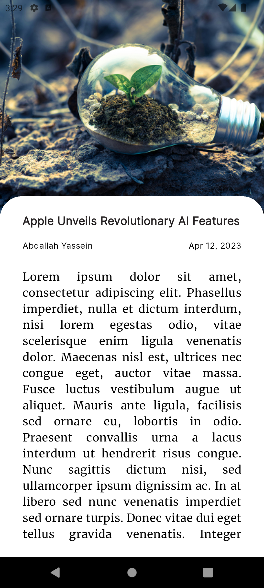
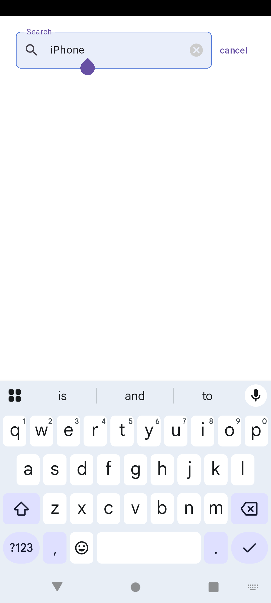
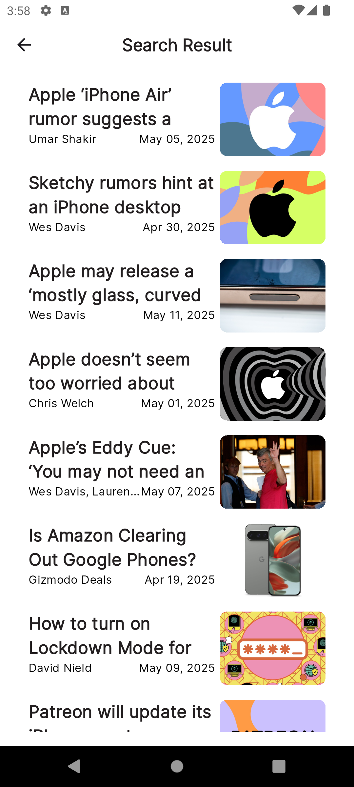

# 📰 News App

A modern, clean, and responsive **Flutter News App** that fetches the latest news articles in real-time using a RESTful API. Designed with Clean Architecture and MVVM principles, this app provides a smooth and organized reading experience with efficient state management using Cubit/Bloc.

## 📱 Features

- 🔍 **Category-based Filtering** (e.g. Business, Sports, Science, Tech)
- 🚀 **Fast Performance** with optimized network calls
- 📡 **Real-time News** via public News API
- 🧭 **Navigation Drawer** for easy navigation
- 🗞️ **Article Details Page** with full content and web view
- 🔄 **Pull to Refresh**
- ✅ **Error Handling** and No Internet UI
  
## 📸 Screenshots
| | | | | 
|--|--|--|--|
|  |  |  |  |

**
## 🔌 API Integration

This app uses the [NewsAPI.org](https://newsapi.org/) to fetch breaking news and headlines.

> **Note:** You’ll need your own API key from [newsapi.org](https://newsapi.org/register).

## 🧱 Architecture

The app is built with **Clean Architecture** and follows the **MVVM (Model-View-ViewModel)** pattern for scalable and testable code.


## ⚙️ How to Run

1. **Clone the repo:**
   ```bash
   git clone https://github.com/your-username/news_app.git
   cd news_app
   

## 📦 Packages Used
- http
- flutter_bloc
- equatable
- cached_network_image
- url_launcher
- connectivity_plus


## ✨ Highlights
- ✅ **Clean and maintainable codebase**
- ✅ **Scalable architecture for production apps**
- ✅ **Ready for real-world deployment with proper error handling**
- ✅ **Fast UI with image caching and performance optimization**
- ✅ **Fully responsive for multiple screen sizes**
- ✅ **Offline-safe UX and friendly error states**


📄 License
This project is open-source and available under the MIT License.

## 🙋‍♂️ About Me
Ephraim Youssef Shafiq
Flutter Developer | AI Enthusiast
- **🚀 I'm passionate about building efficient and intelligent mobile apps. I’ve worked on real-world applications including AI-powered weather and meal recommendation systems during my internship at Cellula Technologies.**
- **📍 Cairo, Egypt**
- **🔗 Portfolio: (https://ephraimyou.github.io/my-portfolio/)**
- **📧 Email: afraiemyouse56@gmail.com**

